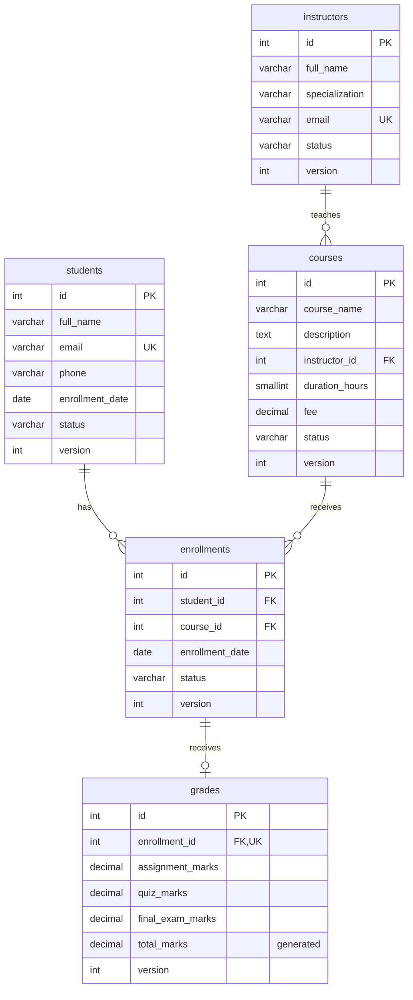

# Data model

The runtime database has exactly five core tables. Technical `version`, `created_at` and `updated_at` fields support safe editing and record timestamps without adding an authentication or analytics subsystem.

## Relationships

One instructor can teach zero or many courses. Each course requires one instructor. One student can have zero or many enrollments, and one course can have zero or many enrollments. The enrollment table resolves that many-to-many relationship. An enrollment has zero or one grade record.

`UNIQUE(student_id, course_id)` prevents duplicate enrollment in the same course, including duplicate records with different statuses. `UNIQUE(enrollment_id)` prevents multiple grade records for one enrollment.

All foreign keys use `ON DELETE RESTRICT` and `ON UPDATE RESTRICT`. Identifiers are permanent. Deleting a parent record never automatically destroys its dependent academic records.

## Data types and constraints

IDs are unsigned integers. Names and contact data use bounded strings. Descriptions use TEXT with a 5,000-character application limit. Dates are DATE columns. Fees and marks use DECIMAL, not floating-point storage. Durations are whole hours.

Email uniqueness is case-insensitive within each master table. An individual may have a student record and an instructor record with the same email; the brief does not require global uniqueness across both tables.

Status columns use an ASCII binary collation so server CHECK constraints do not accidentally accept different capitalization. MySQL CHECK constraints enforce master statuses, enrollment statuses, nonnegative fee, positive bounded duration and marks between 0 and 100. Date comparisons with today and between related records are validated by Python.

`total_marks` is a stored generated column. Operators cannot supply a separate, inconsistent total. An absent grade is represented by no grade row, not by three default zero values.

## Indexing

Primary keys, unique constraints and foreign-key indexes support joins and identity lookups. Name, student status, enrollment status and enrollment-date indexes are supplied. Substring searches beginning with a wildcard are intended for this mini-project's scale; they are not claimed to be full-text search or large-scale query optimization.

## Revisions and transactions

Each successful application update increments `version`. Edit and delete operations compare the version shown to the operator with the current database version while holding a row lock. Stale changes are rejected rather than silently overwriting another operator's work. Related-row checks and writes run in the same MySQL transaction.
